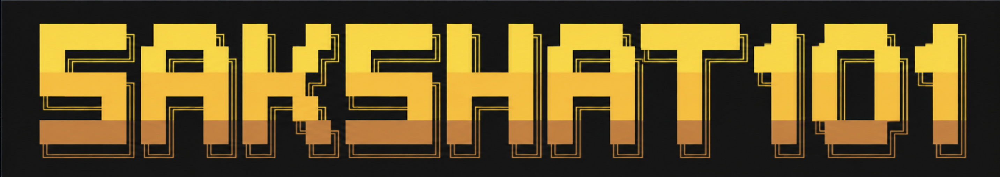

<!-- ========================= BANNER ========================= -->

<p align="center">
  
</p>

<!-- ====================== TYPING TEXT ======================= -->

<p align="center">
  <a href="https://git.io/typing-svg">
    
  </a>
</p>

<!-- ====================== TAGLINE ======================= -->

<p align="center">
  <b>
    AI Automation • Full Stack Development • Machine Learning • Building Profitable AI Systems
  </b>
</p>

---

#  About Me

```python
class Sakshat:
    def __init__(self):
        self.username = "Sakshat101"
        self.role = "AI Engineer & Full-Stack Builder"
        self.location = "India 🇮🇳"

        self.focus = [
            "AI Agents",
            "Workflow Automation",
            "Full-Stack Development",
            "Machine Learning",
            "Business Automation",
        ]

        self.currently_building = [
            "Production-ready AI Systems",
            "Automation Workflows",
            "Lead Generation Engines",
            "Real-world SaaS Products",
        ]

        self.ask_me_about = [
            "AI Agents",
            "LLMs",
            "RAG",
            "Automation",
            "Full Stack",
            "Machine Learning",
        ]

        self.motto = "We Ball ! Bet 🚀"

    def life_goal(self):
        return "Build technology that creates real impact and real profit."
```

<br/>

---

## **Featured Projects**

<div align="center">

| 🏥 Pneumonia Detection AI | 📈 LSTM Stock Predictor |
|:---:|:---:|
| Deep learning model to detect pneumonia from chest X-rays using CNNs | LSTM-based neural network for time-series stock price forecasting |
| [](https://github.com/Sakshat101/Pneumonia-Detection-AI) | [](https://github.com/Sakshat101/LSTM-Stock-price-prediction) |

| 📄 Contract IQ | 📚 Ask My Docs |
|:---:|:---:|
| AI-powered contract analysis and intelligence tool | RAG-based document Q&amp;A — chat with your PDFs &amp; docs |
| [](https://github.com/Sakshat101/Contract-IQ) | [](https://github.com/Sakshat101/ask-my-docs) |

</div>

<br/>

---
##  Tech Stack

<div align="center">

**Languages**


**Frameworks & Libraries**


**ML / AI**


**AI Tools & Platforms**


**Databases**


**DevOps & Cloud**


**Design & Tools**


</div>

<br/>

---

##  GitHub Stats

<div align="center">
  
  
</div>

<div align="center">
  
</div>

<br/>

---

##  Dev Joke 

<div align="center">
  
</div>

> 🔄 Refreshes with a new joke on every profile visit — because good code deserves good laughs.

<br/>

---

## 📬 Let's Connect

<div align="center">

[](https://linkedin.com/in/sakshat-keote)
[](https://github.com/Sakshat101)
[](mailto:sakshatkeote17@gmail.com)
[](https://instagram.com/17_sakshat)

<br/>


</div>

<br/>

<!-- Footer -->
<div align="center">
  
</div>
